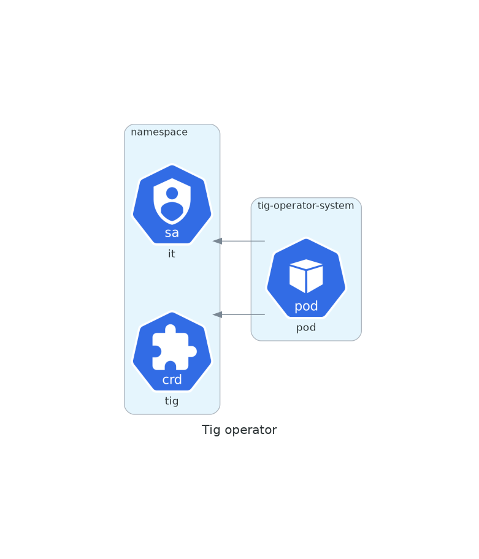

# Simple operator (kubebuilder)

An operator that just creates a tig object wherever a service account named it
is created

Run `make docker-build` push the image somewhere your cluster has access then
run:
`make deploy` to deploy the operator

The setup should look like this:

